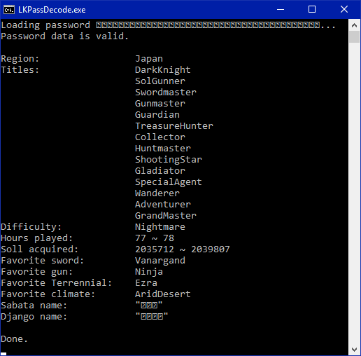

# LKPassDecode
A teeny-tiny tool that decodes and analyzes Boktai DS/Lunar Knights passwords.
Supports Japanese, North American and European passwords.
It extracts all the information in the password, which is the following:

* Game region;
* Acquired titles;
* Difficulty level;
* Number of hours played;
* Amount of Soll acquired;
* Favorite sword, gun, Terrennial, climate;
* Player names for Django/Aaron and Sabata/Lucian.

For inclusion in other projects, you can simply use `BoktaiDSPassword.cs`.
See `Program.cs` for example usage.

There's also a partial table file for the game, up to character `82 77`.

# License
Public domain.
No credit necessary.
See `LICENSE.txt` for details.